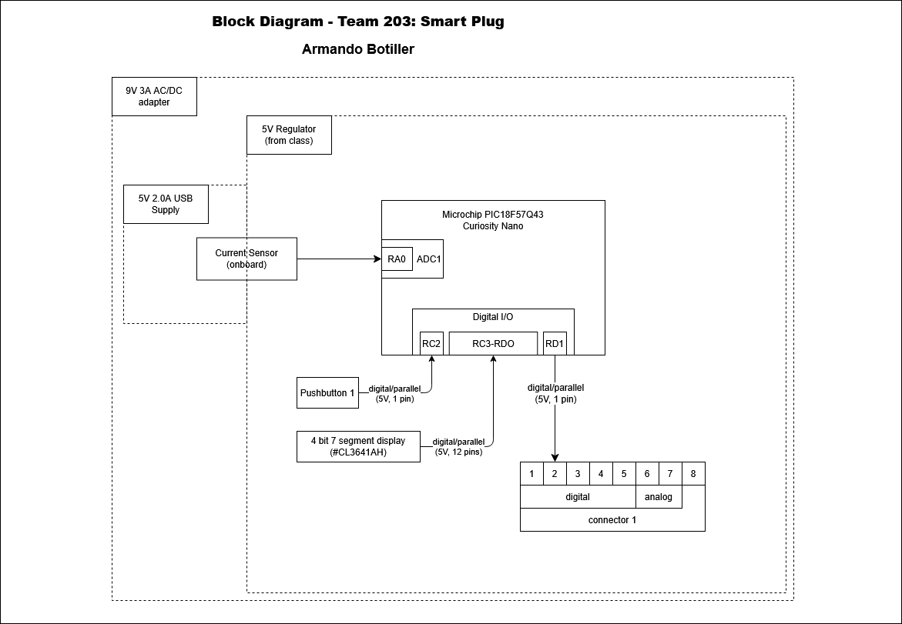

## Overview
The block diagram is a way to clearly lay out each team member's individual project, consisting of one or more analog sensors and/or actuators.

The block diagram below describes the current sensing and power/energy usage display functionality of a USB charging port, which is part of a larger smart plug with multiple outlets and USB charging ports.

In this block diagram there is one main power source, a 9V 3A AC/DC adapter that will charge the device being monitored as well as power the rest of the design via a 5V regulator.

This individual part intends to calculate power in watts and energy in kWh and display it to a 4 bit 7 segment display for monitoring. It also sends a digital signal to digital pin 2 on the ribbon connector so that another device can verify that the device is measuring current.

## Block Diagram Image
  
*Armando Botiller's Individual Block Diagram*