# Main Components

## Voltage Regulator
1. LM7805CT/NOPB Fixed 5V Linear Regulator
    
    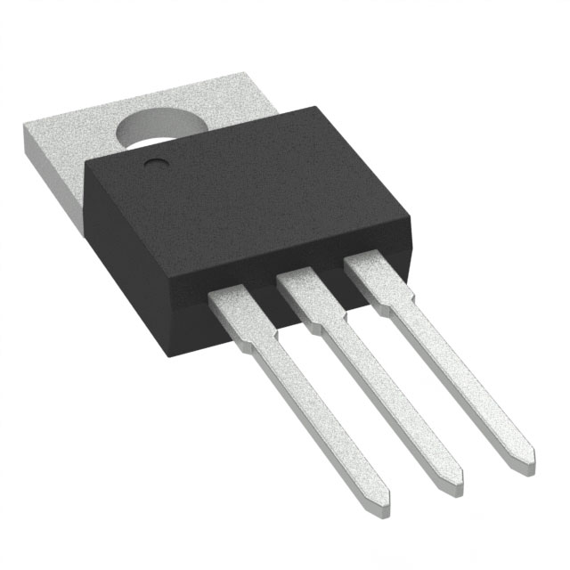

    * $1.80/each
    * [link to product](https://www.digikey.com/en/products/detail/texas-instruments/LM7805CT-NOPB/3901929)

    | Pros                                                                  | Cons                                                                                           |
    | --------------------------------------------------------------------- | ---------------------------------------------------------------------------------------------- |
    | Built-in over current and thermal shutdown protection.                | Low efficiency because wastes excess input power as heat, also requiring heat large sink for high power. |
    | Fixed 5V low noise output, which is ideal for standard digital logic  | High dropout voltage requires input voltage to be at least 2V higher than 5V output.           |
    | Very low cost and universally available                               | Through hole package not suitable for miniaturization                                          |
    | Through hole consistent with rest of project.                         | Not rated for 3A current required for project.                                                 |

2. LM2576T-5.0/NOPB Buck Switching Regulator IC Positive Fixed 5V Output                                                                 
    
    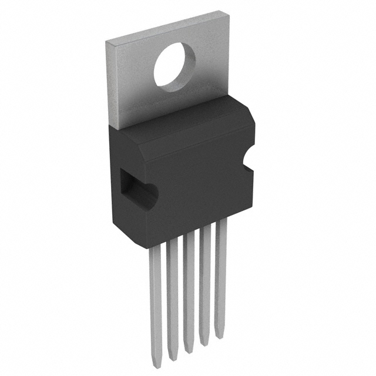

    * $3.54/each
    * [link to product](https://www.digikey.com/en/products/detail/texas-instruments/LM2576T-5-0-NOPB/212636)

    | Pros                                                                                                          | Cons                                                                                                                                         |
    | ------------------------------------------------------------------------------------------------------------- | -------------------------------------------------------------------------------------------------------------------------------------------- |
    | High efficiency and low heat not requiring large heat sinks                                                   | Requires 4 essential external components increasing circuit complexity and cost.                                                             |
    | Wide 4-40V input range, input voltage only needs to be slightly higher unlike high dropout linear regulator.  | Generally unsuitable for powering noise-sensitive circuits without filtering due to electromagnetic interference and output ripple           |
    | High 3A output current suitable for project                                                                   | Large inductor required compared to higher frequency switchers.                                                                              |
    | Through hole consistent with rest of project.                                                                 |                                                                                                                                              |

3. LM1085IT-5.0 Fixed 5V Linear Regulator
    
    

    * $3.34/each
    * [link to product](https://www.digikey.com/en/products/detail/texas-instruments/LM1085IT-5-0/3694822)

    | Pros                                                                  | Cons                                                                                                          |
    | --------------------------------------------------------------------- | ------------------------------------------------------------------------------------------------------------- |
    | Built-in over current and thermal shutdown protection.                | Massively inefficient at full load, requiring bulky heatsink.                                                 |
    | Fixed 5V low noise output, which is ideal for standard digital logic  | Obsolete product; not recommended for new designs                                                             |
    | 3A output fulfills project power budget requirements                  | High quiescient current of 10 mA means there is constant 10mA current draw when nothing else is being powered.|
    | Lower 1.5V dropout voltage than LM7805.                               | Through hole package not suitable for miniaturization                                                         |
    | Through hole consistent with rest of project.                         |                                                                                                               |

>**Choice:** LM1085IT-5.0 Fixed 5V Linear Regulator 
**Rationale:** This regulator fulfills the class requirements of having a linear regulator as well as power budget requirements.

## Current sensor

1. ALLEGRO CURRENT SENSOR HE/OL 31A 12-QFN (ACS711KEXLT-31AB-T)
    
    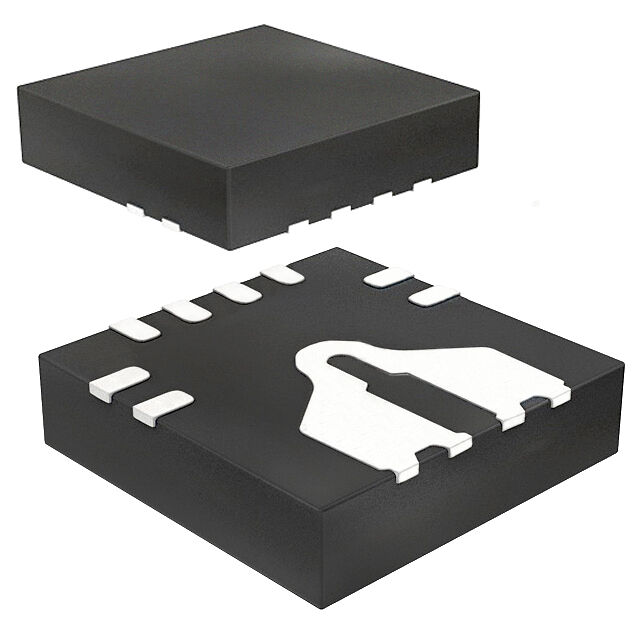

    * $1.02/each
    * [link to product](https://www.digikey.com/en/products/detail/allegro-microsystems/ACS711KEXLT-31AB-T/3868195?s=N4IgTCBcDaIIIGEDKB2AjGg0gUQBoBkAVAWgGY04AhYwkAXQF8g)

    | Pros                                                          | Cons                                                                                           |
    | ------------------------------------------------------------- | ---------------------------------------------------------------------------------------------- |
    | Very small package.                                            | Significantly more cost effective to buy in bulk                        |
    | Senses current up to 31A.                                      | How to analyze and filter signal is not as well understood. |
    | Operates on 5V.                                                | Surface mount differs from rest of components
    | Provides electrical isolation between measuring device and device being measured.                                  |

2. ALLEGRO CURRENT SENSOR HE/OL 10A 8-SOIC (ACS724LLCTR-10AB-T)
    
    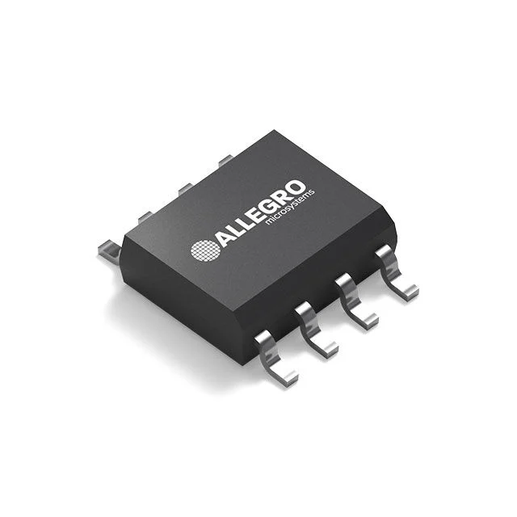

    * $3.31/each
    * [link to product](https://www.digikey.com/en/products/detail/allegro-microsystems/ACS711KEXLT-31AB-T/3868195?s=N4IgTCBcDaIIIGEDKB2AjGg0gUQBoBkAVAWgGY04AhYwkAXQF8g)

    | Pros                                                          | Cons                                                                                           |
    | ------------------------------------------------------------- | ---------------------------------------------------------------------------------------------- |
    | Much lower sensitivity.                                        | More expensive |
    | Operates on 5V.                                                | How to analyze and filter signal is not as well understood. |  
    | Provides electrical isolation between measuring device and device being measured.
    | Higher accuracy|  

3. DIY current sensor by Utsav_25
    
    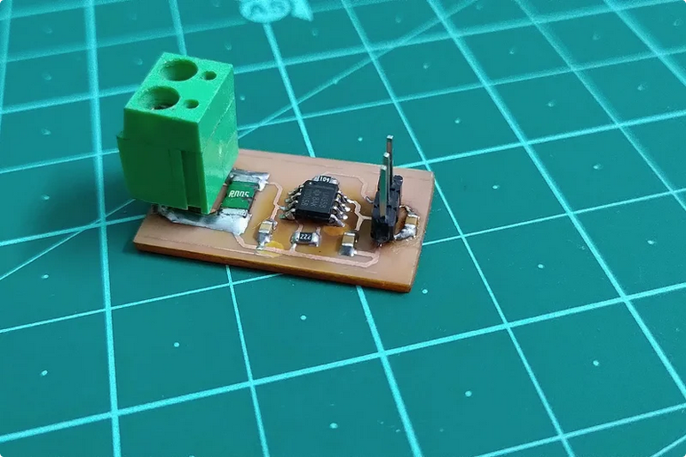
    
    * [link](https://www.instructables.com/DIY-Current-Sensor-20/)

    Schematic: 
    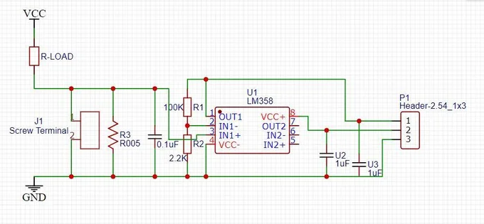
    | Pros                                               | Cons                                                                                           |
    | -------------------------------------------------- | ---------------------------------------------------------------------------------------------- |
    | No hall sensor required.                            | Unknown sensitivity or precision |
    | Non-inverting op-amp fulfills class requirements.  | Must build yourself |  
    | Circuit can easily be integrated into subsystem PCB. | Shunt resistor type current sensing generates heat and there is a slight loss of voltage. |
    |                                                    | Provides **no** electrical isolation between measuring device and device being measured. |

4. Self made low side current sensor based on "An Engineer’s Guide to Current Sensing" by Scott Hill et al. on ti.com using MSR3-0R01F1 as a shunt resistor
    
    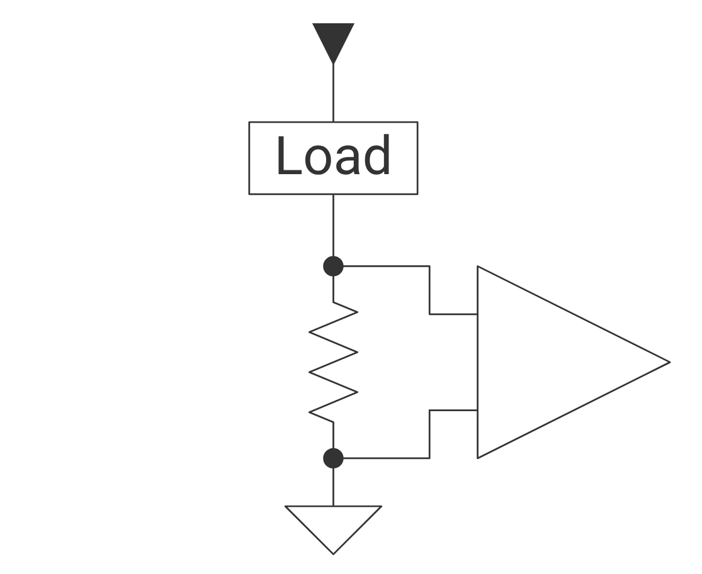
    *img src: https://www.ti.com/technologies/current-sensing-solutions.html#tab-2*

    * [link to guide](https://www.ti.com/lit/eb/slyy154b/slyy154b.pdf?ts=1763525864489&ref_url=https%253A%252F%252Fduckduckgo.com%252F)
    * Schematic: [link](/04-Schematic/schematic/)

    Shunt Resistor:
    
    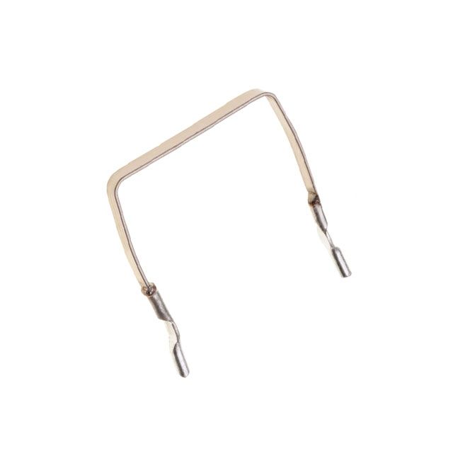

    * $1.78/each
    * [link](https://www.digikey.com/en/products/detail/riedon-products-by-bourns/MSR3-0R01F1/1641076)
    
    | Pros                                                               | Cons                                                                                           |
    | ------------------------------------------------------------------ | ---------------------------------------------------------------------------------------------- |
    | Low side current sensing requires less power on the shunt resistor | Must build yourself                                                                            |
    | Non-inverting op-amp fulfills class requirements.                  | Shunt resistor type current sensing generates heat and there is a slight loss of voltage.      |
    | Circuit can easily be integrated into subsystem PCB.               | Provides **no** electrical isolation between measuring device and device being measured.       |                                                                     

>**Choice:** Self made current sensor based on Texas Instruments guide using MSR3-0R01F1 0.01 ohm 5W resistor. 
**Rationale:** Circuit can be built with readily available parts besides the shunt resistor, mounted to the same PCB that the rest of the subsystem is connected to. Creating the circuit also allows the use of an op-amp to fulfill the project requirement for filtering signals. Lastly, making it provides an opportunity to learn how shunt type current sensors function.

## Amplifier/Current monitor
1. Texas Instruments Current Monitor (INA226AIDGSR)
    
    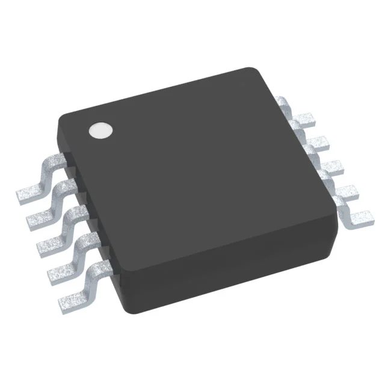

    * $2.58/each
    * [link to product](https://www.digikey.com/en/products/detail/texas-instruments/INA226AIDGSR/2687118)

    | Pros                                                                                                                     | Cons                                                                                                                                          |
    | ------------------------------------------------------------------------------------------------------------------------ | --------------------------------------------------------------------------------------------------------------------------------------------- |
    | Performs full measurement of current, bus voltage, and calculated power using built-in analog to digital converter(ADC). | Must calibrate firmware with a calibration register derived from specific external shunt resistor to achieve accurate output.                 |
    | High accuracy with gain error of only 0.1% and bi-directional sensing                                                    | System accuracy is highly dependent on the quality of external shunt resistor.                                                                |
    | Wide independent common-mode range; can measure current across 0-36V buses despite 2.7-5.5V supply voltage.              | Bandwidth and conversion time are slow with integrated ADC; not suitable for high-speed applications where <8 ms conversion rate is required. |
    || Surface mount not consistent with rest of project. |

2. Broadcom Limited Current sense amplifier (HCPL-7520-000E)
    
    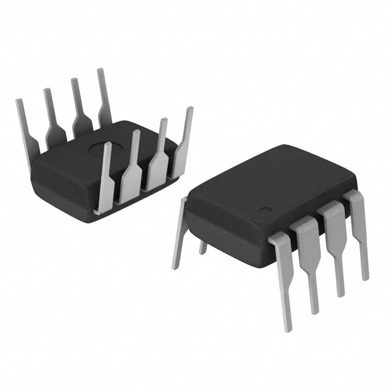

    * $5.26/each
    * [link to product](https://www.digikey.com/en/products/detail/broadcom-limited/HCPL-7520-000E/825320)

    | Pros                                                                                                                | Cons                                                                                                                                          |
    | ------------------------------------------------------------------------------------------------------------------- | --------------------------------------------------------------------------------------------------------------------------------------------- |
    | High galvanic isolation barrier allowing measurement current to float and protect low-voltage control circuitry.    | Input side requires its own isolated power supply to establish isolation barrier.                                                             |
    | Highly immune to noise with >10 kV/microsecond common-mode rejection crucial for switching environments.            | External shunt resistor required.                                                                                                             |
    | Highly accurate analog output.                                                                                      | Output is analog unlike INA226 which is a digital monitor because it includes an ADC.                                                         |

3. MCP6004-I/P Operational Amplifier
    
    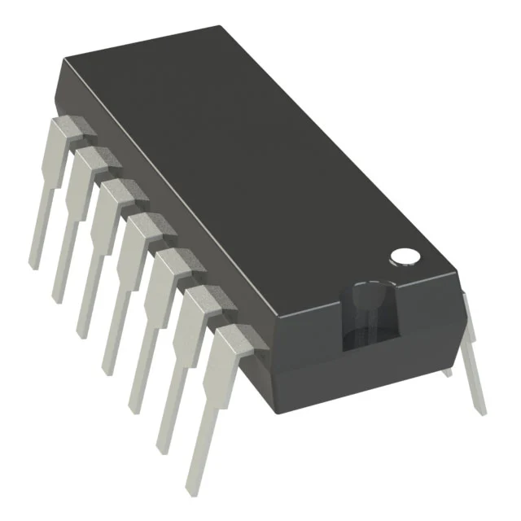

    * $0.59/each
    * [link to product](https://www.digikey.com/en/products/detail/microchip-technology/MCP6004-I-P/523060)

    | Pros                                                                                                                              | Cons                                                                                                                                                          |
    | --------------------------------------------------------------------------------------------------------------------------------- | ------------------------------------------------------------------------------------------------------------------------------------------------------------- |
    | Rail-to-rail input/output meaning voltage can swing very close to power supply rails, maximizing available signal range.          | High input offset voltage (+-4.5 mV) making it unsuitable for precision sensing of very low currents without removing the offset.                             |
    | Low quiescent current (100 micramps per amplifer) and quad-channel; cost and space efficient.                                     | Limited common-mode voltage range; cannot typically withstand voltages higher than its supply rail (6V) making it only suitable for low-side current sensing. |
    | Extremely low cost and versatility; can easily configure it for different roles, e.g. differential, inverting, and non-inverting. | Only one out of four op-amps are being used in the design                                                                                                     |
    | Through hole consistent with rest of project |

>**Choice**: MCP6004-I/P Operational Amplifier
**Rationale:** This amplifier is already available in class, meaning no additional purchases would be required besides the shunt resistor to have a functioning current sensor. And, while a dedicated current monitoring chip or current sensing amplifier would be better for accurate current sensing, using a general op-amp is a better learning opportunity.

## Display

1. DFRobot 32 Digit 16x2 Transmissive LCD (DFR0555)
    
    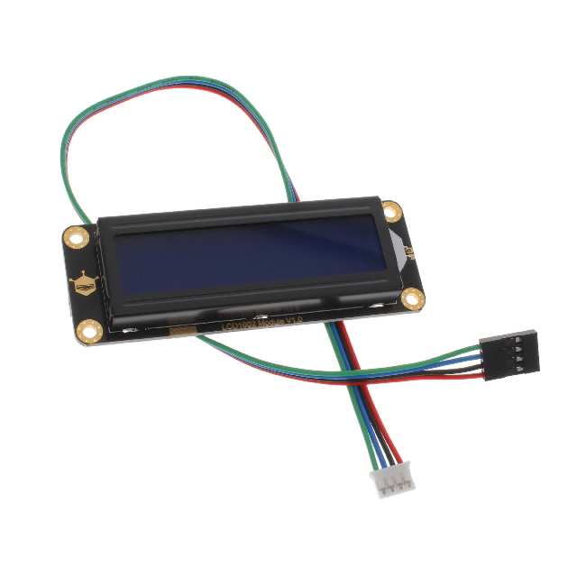
    
    * $9.90/each
    * [link to product](https://www.digikey.com/en/products/detail/dfrobot/DFR0555/9356340)
    
    | Pros                                                                                      | Cons                                                                                           |
    | ----------------------------------------------------------------------------------------- | ---------------------------------------------------------------------------------------------- |
    | More descriptive than segment display.                                                     | Daughter board does not fit within scope of project. |
    | I2C interface allows serial communication using minimal pins.                              | More expensive without significant added functionality for user requirements. |  

2. uxcell 3 bit 7 segment display (LD5631BG?)
    
    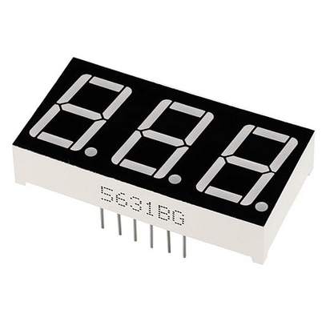

    * $1.70/each
    * [link to product](https://a.co/d/5Iz0CXA)

    | Pros                                                                                      | Cons                                                                                           |
    | ----------------------------------------------------------------------------------------- | ---------------------------------------------------------------------------------------------- |
    | Descriptive enough for project.                                                            | Significantly more pins required than I2C LCD interface.                                        |
    | Less current draw than LCD.                                                                | Not clear whether it is exactly the same as LD5631BG which has a datasheet.                                                           |
    | Simpler than LCD.                                                                          |
    | Through-hole mount interfaces well with our PCB design.                                    |
    | Ships from Amazon in a reasonable amount of time.                                          |

3. 	Dual Digit Alphanumeric 16 segment LED display (OPS-AD4021LR-GW)
    
    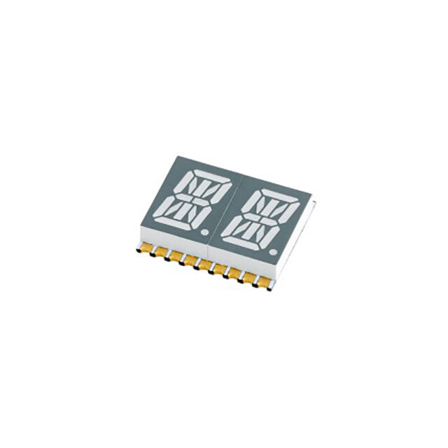

    * $4.24/each
    * [link to product](https://www.digikey.com/en/products/detail/opto-plus-led-corp/OPS-AD4021LR-GW/25956612)

    | Pros                                                                                      | Cons                                                                                           |
    | ----------------------------------------------------------------------------------------- | ---------------------------------------------------------------------------------------------- |
    | More descriptive capability than 7 segment display                                        | Significantly more pins required.
    | Less current draw than LCD                                                                | More expensive than 7 segment version |
    | Simpler than LCD                                                                          | Must buy in bulk far exceeding project budget.
    ||Surface mount
 
4. 7 Segment 3 Digit 0.56" Green Display BA56-12GWA
    
    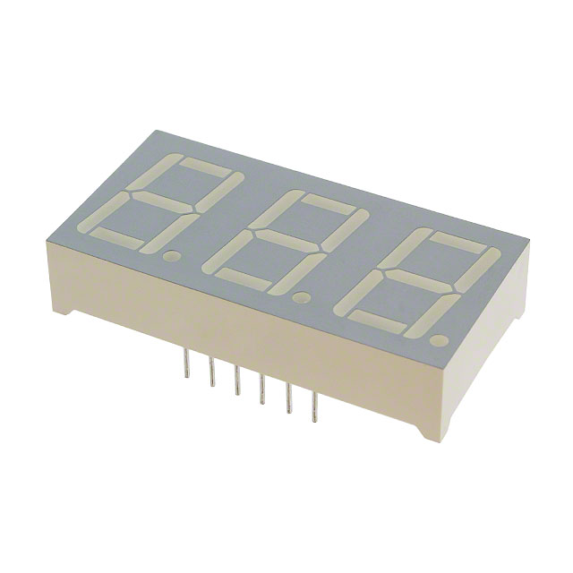

    * $5.30/each
    * [link to product](https://www.digikey.com/en/products/detail/kingbright/BA56-12GWA/3084327?s=N4IgTCBcDaIEIEECsA2AtARjAcQOoJAF0BfIA)

    | Pros                                                                                       | Cons                                                                                           |
    | ------------------------------------------------------------------------------------------ | ---------------------------------------------------------------------------------------------- |
    | Descriptive enough for project.                                                            | Significantly more pins required than I2C LCD interface.                                       |
    | Less current draw than LCD.                                                                |
    | Simpler than other displays.                                                               |                                   
    | Has datasheet                                                                              |
    | Green color more readable than other colors.                                               |
    | Through hole matches with all other components in design.                                  |         

>**Choice:** 7 Segment 3 Digit 0.56" Green Display (BA56-12GWA) 
**Rationale:** This product fulfills the need to display power/energy use without too much complexity, is through hole, includes a datasheet, and can be bought along with the other digikey components.

## Summary table of final selected components
The selected components are the main components used to construct the power monitor board.

| Component | Model # | Link to datasheet | Function |
| --------- | ------- | ----------------- | -------- |
| Fixed 5V Linear Regulator | LM1085IT-5.0 | [link](https://www.ti.com/general/docs/suppproductinfo.tsp?distId=10&gotoUrl=https%3A%2F%2Fwww.ti.com%2Flit%2Fgpn%2Flm1085) | Takes input voltage from power supply and converts it to 5V used to power all other components in the circuit. |
| 0.01 ohm 5W resistor | MSR3-0R01F1 | [link](https://www.bourns.com/docs/Product-Datasheets/MSR.pdf) | Functions as a low-side shunt resistor to measure voltage across in order to get the current through load. |
| Operational Amplifier | MCP6004-I/P | [link](https://www.digikey.com/en/products/detail/microchip-technology/MCP6004-I-P/523060) | Amplifies small signal from shunt resistor to larger signal easily distinguishable to PIC microcontroller.| 
| 7 Segment 3 Digit 0.56" Green Display | BA56-12GWA | [link](https://www.digikey.com/en/products/detail/kingbright/BA56-12GWA/3084327?s=N4IgTCBcDaIEIEECsA2AtARjAcQOoJAF0BfIA) | Displays power monitor output. First two digits are for the value in Watts or kWh, and the third digit distinguishes which one is showing. |
| PIC Curiosity Nano Board | PIC18F57Q43 Curiosity Nano | [chip datasheet](https://ww1.microchip.com/downloads/aemDocuments/documents/MCU08/ProductDocuments/DataSheets/PIC18F27-47-57Q43-Microcontroller-Data-Sheet-XLP-DS40002147.pdf), [hardware guide](https://ww1.microchip.com/downloads/aemDocuments/documents/MCU08/ProductDocuments/UserGuides/PIC18F57Q43-Curiosity-Nano-HW-UserGuide-DS40002186B.pdf) | Microcontroller converts analog signal from current sensor circuit to digital value to then convert to instantaneous power or kWh using internal clock; also communicates with other boards in sparkguard system. |

## MCC Configuration
MCC is the way all pins and modules are configured on the PIC curiosity nano board using Microchip's MPLABX IDE.
1. **Application builder** 
    This shows all modules used.

    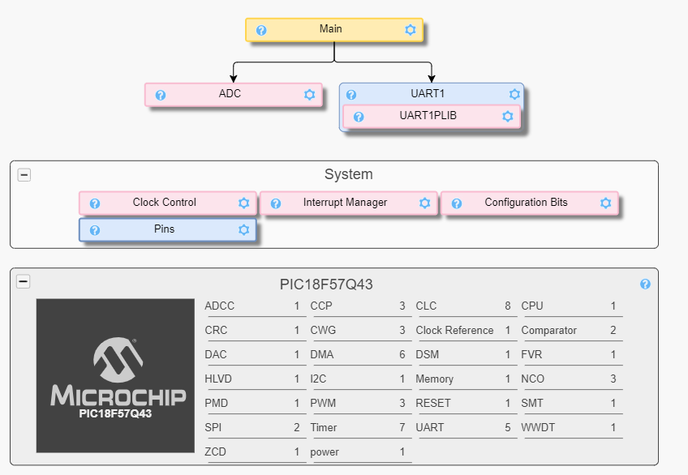

2. **Pin grid**  
    This shows all the pins, grouped by Port and Module, and whether they are inputs or outputs.

    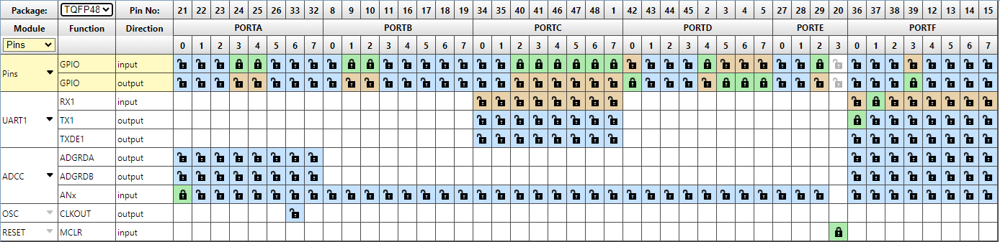

    * Uart1 TX and RX pins are used to necessary for debugging and final subsystem verification.
    * See [block diagram](04-Schematic/schematic/) and [schematic](/site/04-Schematic/schematic/index.html) for more context to pin names.

3. **Pin table**  
    This shows all the pins' names, modules associated, direction, whether they are analog or digital, and custom name used in code.

    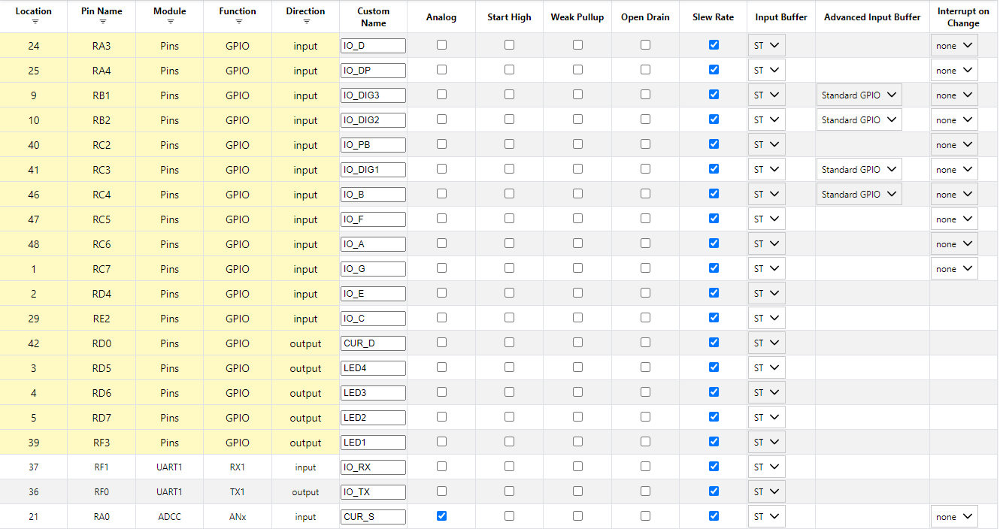