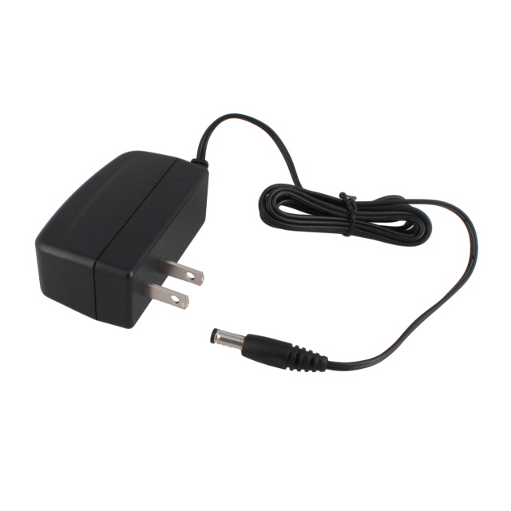
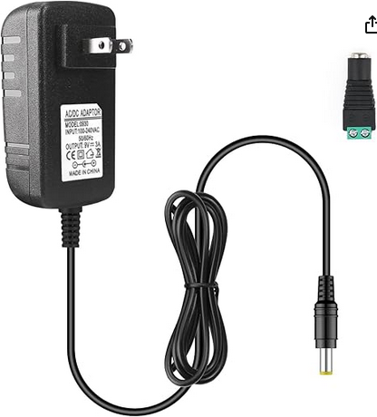
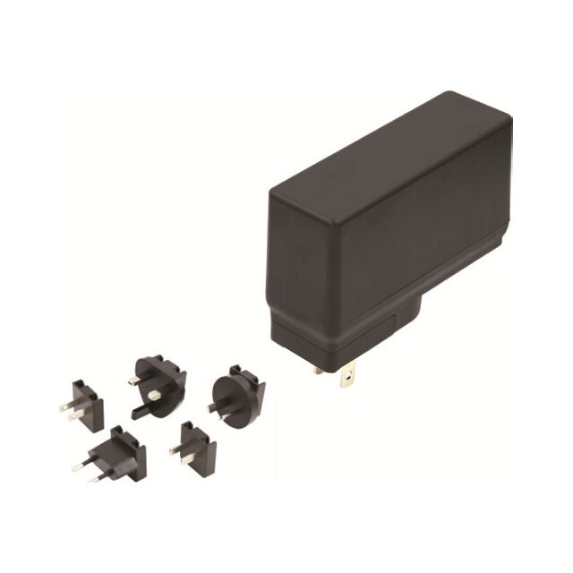

## Components
**9V 3A AC/DC Adapter**
1. WR9HD1333CCP-F(R6B) AC/DC WALL MOUNT ADAPTER 9V 12W

    

    * $6.23/each
    * [link to product](https://www.digikey.com/en/products/detail/globtek-inc/WR9HD1333CCP-F-R6B/13245472)

    | Pros                                                          | Cons                                                                                           |
    | ------------------------------------------------------------- | ---------------------------------------------------------------------------------------------- |
    | Meets power requirements                                      | Only 1.33A output may not be enough to charge device and power circuit.                        |
    | Can connect to barrel jack                                    |
    | Shipped from within US                                        |
    | Includes datasheet                                            |

2. Yetaida 9V 3A Power Supply Adapter, 

    

    * $6.70/each
    * [Link to product](https://a.co/d/h2dbedt)

    | Pros                                                              | Cons                                                                           |
    | ----------------------------------------------------------------- | ------------------------------------------------------------------------------ |
    | Meets voltage and current needs                                   | Some reviewers claim it cannot handle 3A load as advertised.                   |
    | Includes female connector so barrel jack is not necessary         | No datasheet provided                                                          |
    | Shipped by amazon in a few days                                   |

3. SLE36S0903B01 AC/DC WALL MOUNT ADAPTER 9V 27W

    

    * $17.86/each
    * [Link to product](https://www.digikey.com/en/products/detail/sl-power-advanced-energy/SLE36S0903B01/11570443)

    | Pros                                                              | Cons                                                                           |
    | ----------------------------------------------------------------- | ------------------------------------------------------------------------------ |
    | Interchangable input connector for use in other countries         | 14 week lead time                                                              |
    | Meets voltage and current needs                                   |
    | Includes datasheet                                                |

**Choice:** class provided 9V 3A AC/DC adapter

**Rationale:** Adapter is already compatible with class provided barrel jack and doesn't require any additional purchases.

**Current sensor**
1. ALLEGRO CURRENT SENSOR HE/OL 31A 12-QFN (ACS711KEXLT-31AB-T)

    

    * $1.02/each
    * [link to product](https://www.digikey.com/en/products/detail/allegro-microsystems/ACS711KEXLT-31AB-T/3868195?s=N4IgTCBcDaIIIGEDKB2AjGg0gUQBoBkAVAWgGY04AhYwkAXQF8g)

    | Pros                                                          | Cons                                                                                           |
    | ------------------------------------------------------------- | ---------------------------------------------------------------------------------------------- |
    | Very small package                                            | Significantly more cost effective to buy in bulk                        |
    | Senses current up to 31A                                      | How to analyze and filter signal is not as well understood. |
    | Operates on 5V                                                |
    | Through hole compatible pins pins                             |

2. 

**Segment display**

**Pushbutton**