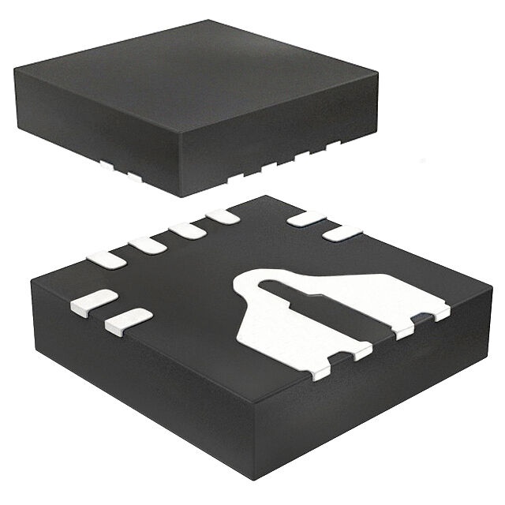
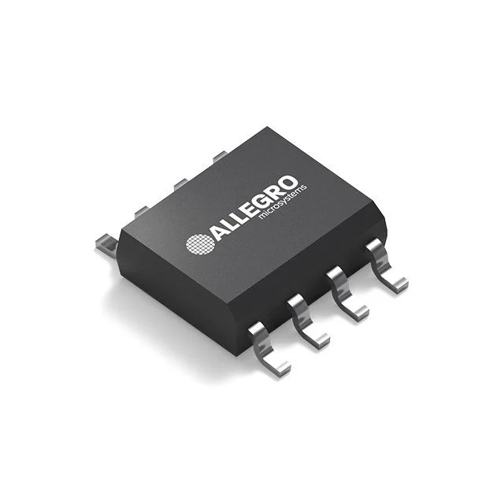
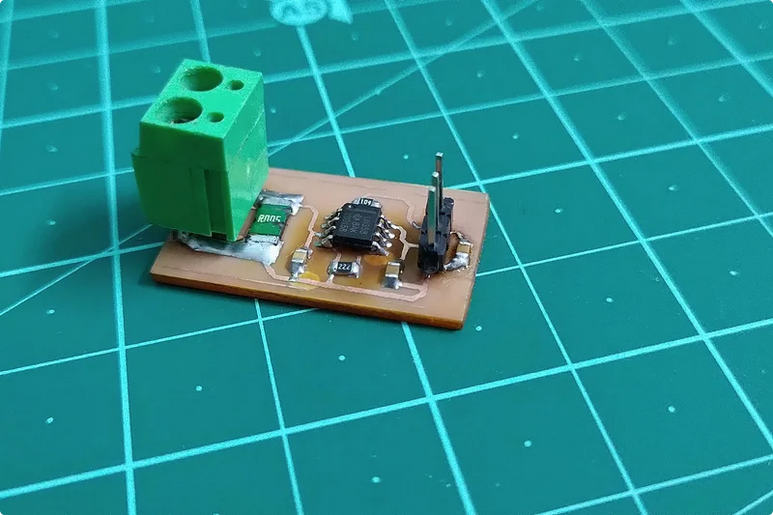
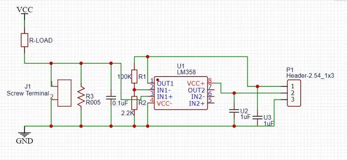
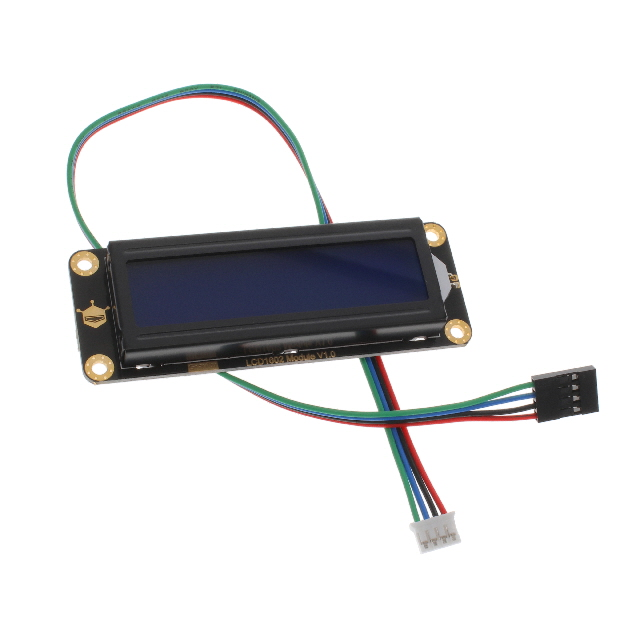
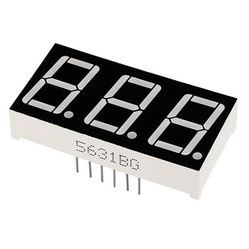
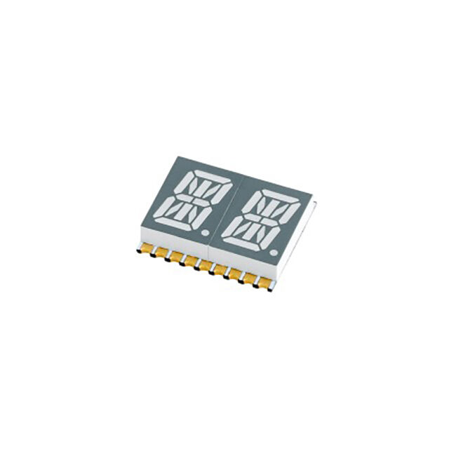

## Main Components

**Current sensor**
1. ALLEGRO CURRENT SENSOR HE/OL 31A 12-QFN (ACS711KEXLT-31AB-T)

    

    * $1.02/each
    * [link to product](https://www.digikey.com/en/products/detail/allegro-microsystems/ACS711KEXLT-31AB-T/3868195?s=N4IgTCBcDaIIIGEDKB2AjGg0gUQBoBkAVAWgGY04AhYwkAXQF8g)

    | Pros                                                          | Cons                                                                                           |
    | ------------------------------------------------------------- | ---------------------------------------------------------------------------------------------- |
    | Very small package.                                            | Significantly more cost effective to buy in bulk                        |
    | Senses current up to 31A.                                      | How to analyze and filter signal is not as well understood. |
    | Operates on 5V.                                                | Surface mount differs from rest of components
    | Provides electrical isolation between measuring device and device being measured.                                  |

2. ALLEGRO CURRENT SENSOR HE/OL 10A 8-SOIC (ACS724LLCTR-10AB-T)
    

    * $3.31/each
    * [link to product](https://www.digikey.com/en/products/detail/allegro-microsystems/ACS711KEXLT-31AB-T/3868195?s=N4IgTCBcDaIIIGEDKB2AjGg0gUQBoBkAVAWgGY04AhYwkAXQF8g)

    | Pros                                                          | Cons                                                                                           |
    | ------------------------------------------------------------- | ---------------------------------------------------------------------------------------------- |
    | Much lower sensitivity.                                        | More expensive |
    | Operates on 5V.                                                | How to analyze and filter signal is not as well understood. |  
    | Provides electrical isolation between measuring device and device being measured.
    | Higher accuracy|  

3. DIY current sensor by Utsav_25
    
    
    * [link](https://www.instructables.com/DIY-Current-Sensor-20/)

    Schematic: 
    
    | Pros                                               | Cons                                                                                           |
    | -------------------------------------------------- | ---------------------------------------------------------------------------------------------- |
    | No hall sensor required.                            | Unknown sensitivity or precision |
    | Non-inverting op-amp fulfills class requirements.  | Must build yourself |  
    | Circuit can easily be integrated into subsystem PCB. | Shunt resistor type current sensing generates heat and there is a slight loss of voltage. |
    |                                                    | Provides **no** electrical isolation between measuring device and device being measured. |

**Choice:** DIY current sensor

**Rationale:** Circuit can be built with readily available parts besides the shunt resistor, mounted to the same PCB that the rest of the subsystem is connected to. Creating the circuit also allows the use of an op-amp to fulfill the project requirement for filtering signals. Lastly, making it provides an opportunity to learn how shunt type current sesnors function.

**Display**
1. DFRobot 32 Digit 16x2 Transmissive LCD (DFR0555)
    
    
    * $9.90/each
    * [link to product](https://www.digikey.com/en/products/detail/dfrobot/DFR0555/9356340)
    
    | Pros                                                                                      | Cons                                                                                           |
    | ----------------------------------------------------------------------------------------- | ---------------------------------------------------------------------------------------------- |
    | More descriptive than segment display.                                                     | Daughter board does not fit within scope of project. |
    | I2C interface allows serial communication using minimal pins.                              | More expensive without significant added functionality for user requirements. |  

2. uxcell 3 bit 7 segment display (LD5631BG?)
    
    * $1.70/each
    * [link to product](https://a.co/d/5Iz0CXA)

    | Pros                                                                                      | Cons                                                                                           |
    | ----------------------------------------------------------------------------------------- | ---------------------------------------------------------------------------------------------- |
    | Descriptive enough for project.                                                            | Significantly more pins required than I2C LCD interface.                                        |
    | Less current draw than LCD.                                                                | Not clear whether it is exactly the same as LD5631BG which has a datasheet.                                                           |
    | Simpler than LCD.                                                                          |
    | Through-hole mount interfaces well with our PCB design.                                    |
    | Ships from Amazon in a reasonable amount of time.                                          |

3. 	Dual Digit Alphanumeric 16 segment LED display (OPS-AD4021LR-GW)
    
    * $4.24/each
    * [link to product](https://www.digikey.com/en/products/detail/opto-plus-led-corp/OPS-AD4021LR-GW/25956612)

    | Pros                                                                                      | Cons                                                                                           |
    | ----------------------------------------------------------------------------------------- | ---------------------------------------------------------------------------------------------- |
    | More descriptive capability than 7 segment display                                        | Significantly more pins required.
    | Less current draw than LCD                                                                | More expensive than 7 segment version |
    | Simpler than LCD                                                                          | Must buy in bulk far exceeding project budget.