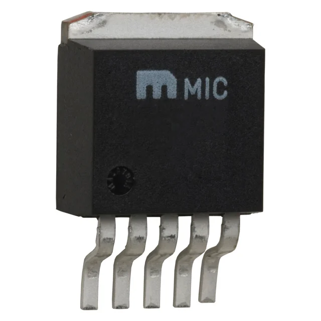
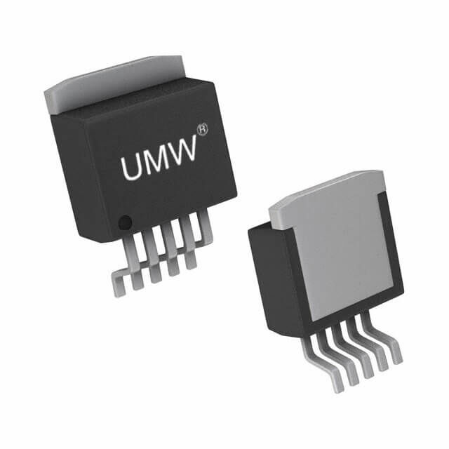
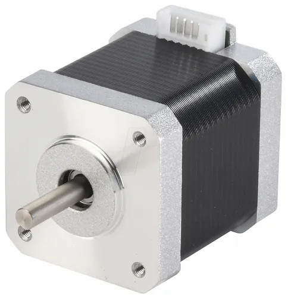
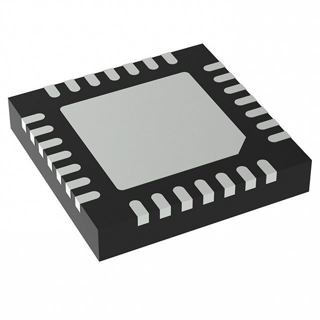

## Module's Selected Major Components

The following sections are the selected major components necessary for the arm system.

## Power Management

### 3.3V Regulator

*Table 1: 3.3V Regulator component selection*

|**Component**                                                                                                                                                                      |**Pros**                                                                                                                                             |**Cons**                                                |
| --------------------------------------------------------------------------------------------------------------------------------------------------------------------------------- | --------------------------------------------------------------------------------------------------------------------------------------------------- | ------------------------------------------------------ |
|  LM2575-3.3WU-TR IC REG BUCK 3.3V 1A TO263-5 $1.75/each [link to product](https://www.digikey.com/en/products/detail/diodes-incorporated/AP1509-50SG-13/1301328)|\* TO263-5 package easy to manually solder. \* 1A is more than enough to power ESP32, LEDs, and other passive components on 3.3V rail. \* More efficient than linear regulator.|\* Requires more complex circuity than linear regulator.|

### 5V Regulator

*Table 2: 5V Regulator component selection*

|**Component**                                                                                                                                                                      |**Pros**                                                                                                                                             |**Cons**                                                |
| --------------------------------------------------------------------------------------------------------------------------------------------------------------------------------- | --------------------------------------------------------------------------------------------------------------------------------------------------- | ------------------------------------------------------ |
|  AP1509-50SG-13 IC REG BUCK 5V 2A 8SOP $1.21/each [link to product](https://www.digikey.com/en/products/detail/diodes-incorporated/AP1509-50SG-13/1301328)|\* 8SOP package fairly easy to manually solder. \* 2A is more than enough to drive three 5V RC Servos. \* More efficient than linear regulator.|\* Requires more complex circuity than linear regulator.|
|  LM2592HVS-5.0 IC REG BUCK 5.0V 2A DDPAK $2.00/each [link to product](https://www.digikey.com/en/products/detail/umw/LM2592HVS-5-0/24889665)|* T0-263-5 or DDPAK package easy to manually solder \* Fulfills power budget requirements for RC servos. \* Has a built in heat sink. | \* Larger than 8SOP.|

**Selected component: LM2592HVS-5.0 IC REG BUCK 5.0V 2A DDPAK**

* $2.00/each
* [link to product](https://www.digikey.com/en/products/detail/umw/LM2592HVS-5-0/24889665)
* **Reasoning:** This regulator fulfills the need for a regulator to supply power for 5V servos which control 3/4 joints on the robot arm, and the T0-263-5 package has better heat dissipation than other options.

## Arm Actuation

### Primary actuator

*Table 3: Primary actuators component selection*

| **Component**                                                                                                                                                                                     | **Pros**                                                                                                           | **Cons**                                                                                            |
| ------------------------------------------------------------------------------------------------------------------------------------------------------------------------------------------------- | ------------------------------------------------------------------------------------------------------------------ | --------------------------------------------------------------------------------------------------- |
|   SM-42HB34F08AB STEPPER MOTOR HYBRID BIPOLAR 12VDC $11.84/each [link to product](https://www.digikey.com/en/products/detail/olimex-ltd/SM-42HB34F08AB/21662229)  | \* Inexpensive \* High holding torque 31.15 oz-in easier to implement without gearbox  | \* Limited datasheet page  \*12V rating is the same as supply voltage, meaning motor will be very weak.|
|   42BYG40B-18T42 STEPPER MOTOR HYBRID BIPOLAR 2.25VDC NEMA 17  (unknown price) [link to product](https://www.kysanelectronics.com/Products/cat_pro_rev_inv.php?recordID=6757)|\* 2.25V rating is well below supply voltage. \* Already in posession of this motor. \* Bipolar motor can be driven by selected TMC2209 driver.| \* Motor is no longer be supplied or listed on manufacturer's catalog.|

**Selected component: 42BYG40B-18T42 STEPPER MOTOR HYBRID BIPOLAR 2.25VDC NEMA 17**

* [link to product](https://www.kysanelectronics.com/Products/cat_pro_rev_inv.php?recordID=6757)
* **Reasoning:** With not as much money in the budget left over for the stepper motor, this motor works well with 12V supply voltage, is bipolar, and was already extracted from an old 3D printer. This motor will control the first joint of the robot arm.

### Primary actuator controller

| **Component**                                                                                                                                                                                     | **Pros**                                                                                                           | **Cons**                                                                                            |
| ------------------------------------------------------------------------------------------------------------------------------------------------------------------------------------------------- | ------------------------------------------------------------------------------------------------------------------ | --------------------------------------------------------------------------------------------------- |
|  A4988SETTR-T IC MTR DRVR BIPOLAR 3-5.5V 28QFN $11.84/each [link to product](https://www.digikey.com/en/products/detail/olimex-ltd/SM-42HB34F08AB/21662229)  | \* Lots of documentation to help implement. \* Works within same voltage level as selected ESP32 microcontroller. \* Can control selected bipolar primary actuator with reasonable accuracy. | \* No serial communication options: only logic using 7 wires. \* Expensive compared to simpler options.|
|  TMC2225-SA-T IC MTR DRV 4.75-36V HTSSOP28 $4.61/each [link to product](https://www.digikey.com/en/products/detail/analog-devices-inc-maxim-integrated/TMC2225-SA-T/13996142)|\* Relatively inexpensive compared to other TMC controllers. \* Ultra silent control. \* Works within same voltage level of microcontroller. \* More than enough maximum current output to control selected stepper motor. \* Uses UART serial communication protocol.| \* Does not fulfill requirement of using SPI or I2C.|
|  505-TMC4210-I-ND IC MTR DRV BIPOLAR 3.3-5V 16SSOP $8.55/each [link to product](https://www.digikey.com/en/products/detail/analog-devices-inc-maxim-integrated/TMC4210-I/4500213)|\* Uses SPI \* Device takes computational load off of microcontroller for STEP/DIR control|\* Still requires motor driver to control stepper motor.|
|  TMC260C-PA IC MTR DRV BIPOLAR 3-5.25V 44QFP $10.12/each [link to product](https://www.digikey.com/en/products/detail/analog-devices-inc-maxim-integrated/TMC260C-PA/6154233)|\* Uses SPI and Step/Dir control. \* Operates within 3.3V, same as microcontroller. \*Can supply 2A, well above absolute max draw of selected stepper motor.|\* Expensive compared to other options.|
|  TMC2209-LA-T IC MTR DRV 4.75-28V QFN28 $5.36/each [link to product](https://www.digikey.com/en/products/detail/analog-devices-inc-maxim-integrated/TMC2209-LA-T/10232491)|\* Uses single wire UART for register editing: setting current level, microstep resolution, etc. \*Still uses Step/Direction control. \*contains less pins than other serially controlled options. \*Silent control. \*Relatively inexpensive for functionality included. \*Library for micropython is available on github.|\*Single wire UART with multiple devices is less efficient than I2C or SPI. \*Soldering and debugging solder connections is difficult due to pins being very small and inaccessible from the top.|

**Selected component: TMC2209-LA-T**

* 5.36/each
* [link to product](https://www.digikey.com/en/products/detail/analog-devices-inc-maxim-integrated/TMC2209-LA-T/10232491)
* **Reasoning:** The TMC2209 fulfills the serial communication requirements of the project while being relatively inexpensive, easy to understand how to setup, and usage of it is well documented and a library for micropython is available.

### Secondary actuators

*Table 2: Secondary actuators component selection*

| **Component**                                                                                                                                                                                      | **Pros**                                                                                                           | **Cons**                                                                                            |
| ------------------------------------------------------------------------------------------------------------------------------------------------------------------------------------------------- | ------------------------------------------------------------------------------------------------------------------- | --------------------------------------------------------------------------------------------------- |
|   SER0056 2KG 300 CLUTCH SERVO $6/each [link to product](https://www.digikey.com/en/products/detail/dfrobot/SER0056/13545236)  | \* Inexpensive \* High torque \*Clutch system and electrical protection prevents damage to motor when motor is blocked from rotating.  \* 300 degree range.  \* Easy to control with PWM signal. \* Plastic gears make servo lighter, self lubricating, and more vibration dampening.   | \* Cannot meet serial communication for actuator requirement. \* 300 degree range is superfluous for design as only 180 degrees is required. |
|   SER0011 SERVOMOTOR RC 6V MICRO METAL GEAR $8.62/each [link to product](https://www.digikey.com/en/products/detail/dfrobot/SER0011/7087129) | \* Fairly inexpensive \* 2.5 kg torque \* Metal gears less likely to be stripped by softer structural links attached to motor.             | \*Cannot meeet serial communication for actuator requirement.|
|   SER0039 SERVOMOTOR RC 5V 9G METAL GEAR $5.90/each [link to product](https://www.digikey.com/en/products/detail/dfrobot/SER0039/7087152)| \* Operates at more standard voltage for which there are inexpensive off the shelf regulators. | * Suffers from backlash and angles not as accurate as stepper or higher precision servo. |

**Selected component: SER0039 SERVOMOTOR RC 5V 9G METAL GEAR**

* $5.90/each
* [link to product](https://www.digikey.com/en/products/detail/dfrobot/SER0039/7087152) 
* **Reasoning:** The other considered servomotors have enticing features but would require a non-standard and expensive 6V regulator with at least 1A of output because all three servos in a 3 degree of freedom manipulator stalled would pull ~900mA total. This one operates at 5V making it easier to select a buck converter that can supply enough current for it.