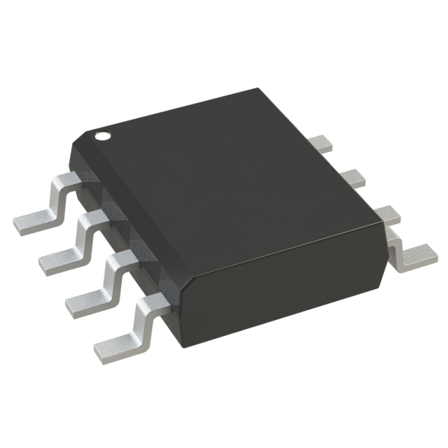
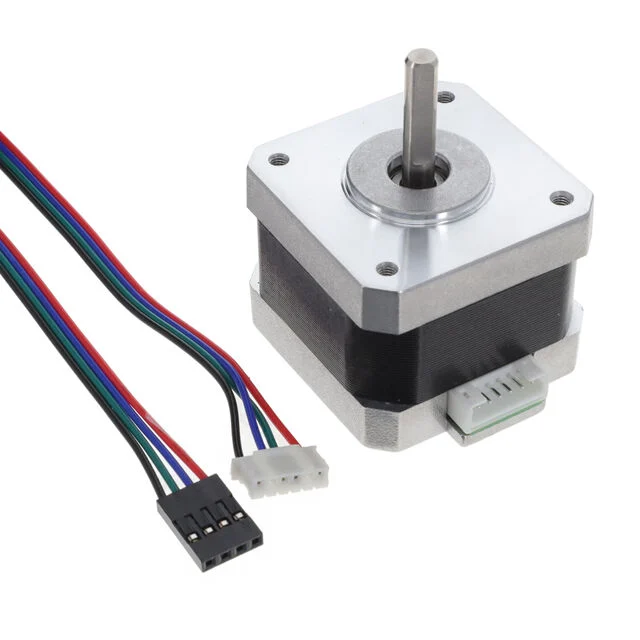
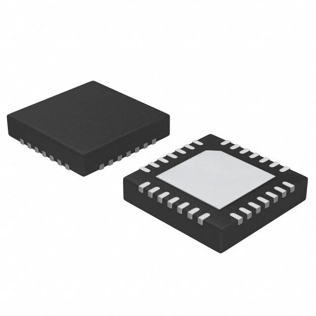
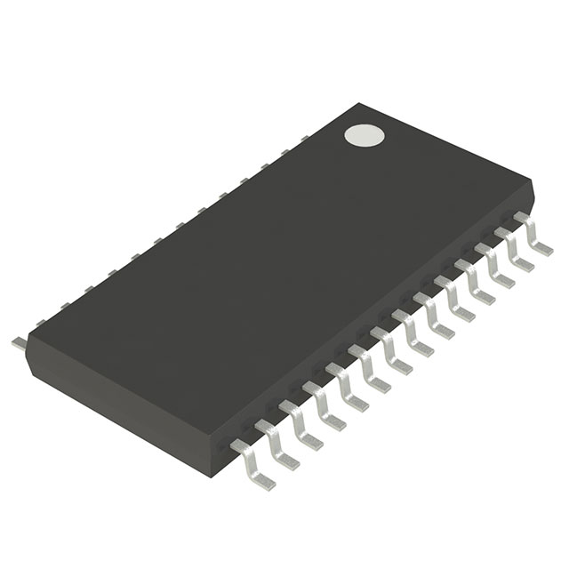
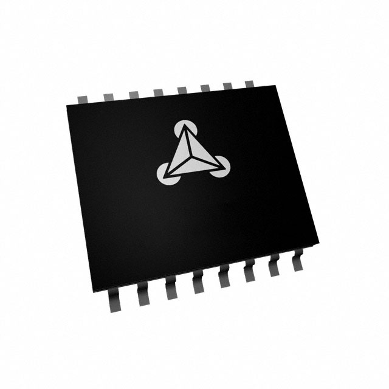
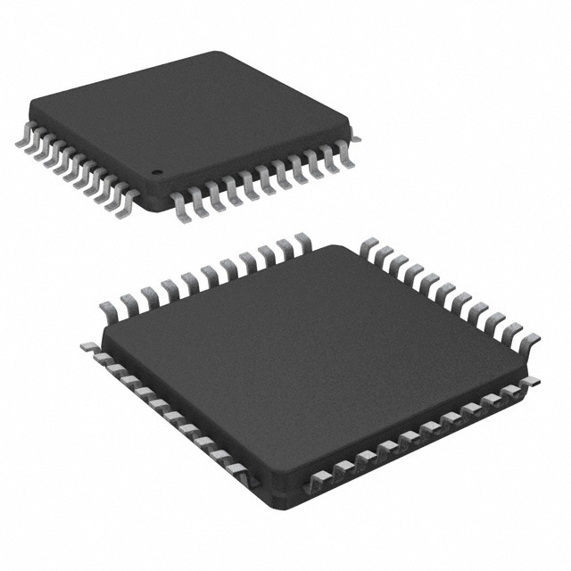
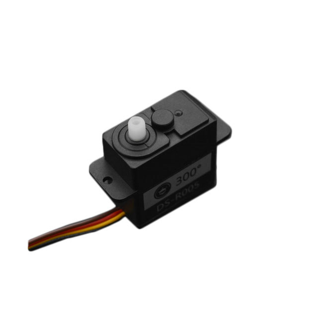
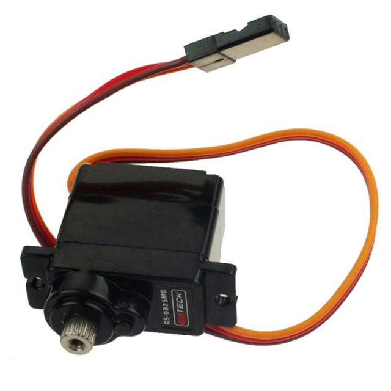
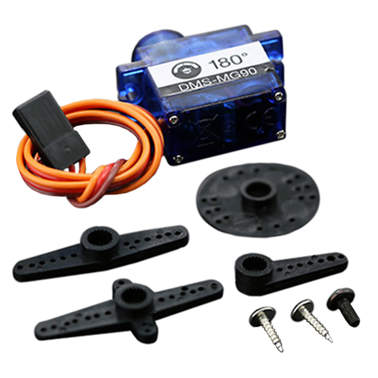

## Module's Selected Major Components

The following sections are the selected major components necessary for the arm system.

## Power Management

### 3.3V Regulator

*Table 1: 3.3V Regulator component selection*

### 5V Regulator

*Table 2: 5V Regulator component selection*

|**Component**                                                                                                                                                                      |**Pros**                                                                                                                                             |**Cons**                                                |
| --------------------------------------------------------------------------------------------------------------------------------------------------------------------------------- | --------------------------------------------------------------------------------------------------------------------------------------------------- | ------------------------------------------------------ |
|  AP1509-50SG-13 IC REG BUCK 5V 2A 8SOP $1.21/each [link to product](https://www.digikey.com/en/products/detail/diodes-incorporated/AP1509-50SG-13/1301328)|\* 8SOP package fairly easy to manually solder. \* 2A is more than enough to drive three 5V RC Servos. \* More efficient than linear regulator.|\* Requires more complex circuity than linear regulator.|

## Arm Actuation

### Primary actuator

*Table 3: Primary actuators component selection*

| **Component**                                                                                                                                                                                     | **Pros**                                                                                                           | **Cons**                                                                                            |
| ------------------------------------------------------------------------------------------------------------------------------------------------------------------------------------------------- | ------------------------------------------------------------------------------------------------------------------ | --------------------------------------------------------------------------------------------------- |
|   SM-42HB34F08AB STEP MOTOR HYBRID BIPOLAR 12VDC $11.84/each [link to product](https://www.digikey.com/en/products/detail/olimex-ltd/SM-42HB34F08AB/21662229)  | \* Inexpensive \* High holding torque 31.15 oz-in easier to implement without gearbox  | \* Limited datasheet page|

### Primary actuator controller

| **Component**                                                                                                                                                                                     | **Pros**                                                                                                           | **Cons**                                                                                            |
| ------------------------------------------------------------------------------------------------------------------------------------------------------------------------------------------------- | ------------------------------------------------------------------------------------------------------------------ | --------------------------------------------------------------------------------------------------- |
|  A4988SETTR-T IC MTR DRVR BIPOLAR 3-5.5V 28QFN $11.84/each [link to product](https://www.digikey.com/en/products/detail/olimex-ltd/SM-42HB34F08AB/21662229)  | \* Lots of documentation to help implement. \* Works within same voltage level as selected ESP32 microcontroller. \* Can control selected bipolar primary actuator with reasonable accuracy. | \* No serial communication options: only logic using 7 wires. \* Expensive compared to simpler options.|
|  TMC2225-SA-T IC MTR DRV 4.75-36V HTSSOP28 $4.61/each [link to product](https://www.digikey.com/en/products/detail/analog-devices-inc-maxim-integrated/TMC2225-SA-T/13996142)|\* Relatively inexpensive compared to other TMC controllers. \* Ultra silent control. \* Works within same voltage level of microcontroller. \* More than enough maximum current output to control selected stepper motor. \* Uses UART serial communication protocol.| \* Does not fulfill requirement of using SPI or I2C.|
|  505-TMC4210-I-ND IC MTR DRV BIPOLAR 3.3-5V 16SSOP $8.55/each [link to product](https://www.digikey.com/en/products/detail/analog-devices-inc-maxim-integrated/TMC4210-I/4500213)|\* Uses SPI \* Device takes computational load off of microcontroller for STEP/DIR control|\* Still requires motor driver to control stepper motor.|
|  TMC260C-PA IC MTR DRV BIPOLAR 3-5.25V 44QFP $10.12/each [link to product](https://www.digikey.com/en/products/detail/analog-devices-inc-maxim-integrated/TMC260C-PA/6154233)|\* Uses SPI and Step/Dir control. \* Operates within 3.3V, same as microcontroller. \*Can supply 2A, well above absolute max draw of selected stepper motor.|\* Expensive compared to other options.|

### Secondary actuators

*Table 2: Secondary actuators component selection*

| **Component**                                                                                                                                                                                      | **Pros**                                                                                                           | **Cons**                                                                                            |
| ------------------------------------------------------------------------------------------------------------------------------------------------------------------------------------------------- | ------------------------------------------------------------------------------------------------------------------- | --------------------------------------------------------------------------------------------------- |
|   SER0056 2KG 300 CLUTCH SERVO $6/each [link to product](https://www.digikey.com/en/products/detail/dfrobot/SER0056/13545236)  | \* Inexpensive \* High torque \*Clutch system and electrical protection prevents damage to motor when motor is blocked from rotating.  \* 300 degree range.  \* Easy to control with PWM signal. \* Plastic gears make servo lighter, self lubricating, and more vibration dampening.   | \* Cannot meet serial communication for actuator requirement. \* 300 degree range is superfluous for design as only 180 degrees is required. |
|   SER0011 SERVOMOTOR RC 6V MICRO METAL GEAR $8.62/each [link to product](https://www.digikey.com/en/products/detail/dfrobot/SER0011/7087129) | \* Fairly inexpensive \* 2.5 kg torque \* Metal gears less likely to be stripped by softer structural links attached to motor.             | \*Cannot meeet serial communication for actuator requirement.|
|   SER0039 SERVOMOTOR RC 5V 9G METAL GEAR $5.90/each [link to product](https://www.digikey.com/en/products/detail/dfrobot/SER0039/7087152)| \* Operates at more standard voltage for which there are inexpensive off the shelf regulators. | * Suffers from backlash and angles not as accurate as stepper or higher precision servo. |

**Selected component: SER0039 SERVOMOTOR RC 5V 9G METAL GEAR**

* $5.90/each 
* [link to product](https://www.digikey.com/en/products/detail/dfrobot/SER0039/7087152) 
* **Reasoning:** The other considered servomotors have enticing features but would require a non-standard and expensive 6V regulator with at least 1A of output because all three servos in a 3 degree of freedom manipulator stalled would pull ~900mA total. This one operates at 5V making it easier to select a buck converter that can supply enough current for it.