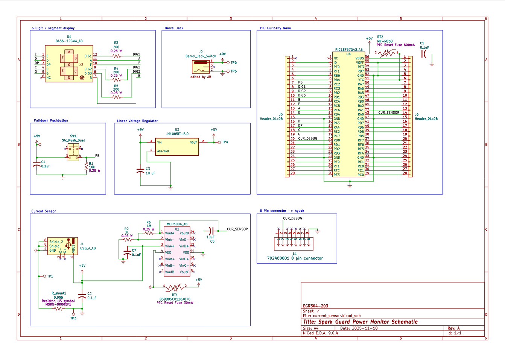

## Overview
This Schematic describes the current sensing and power monitoring display portion of the Spark Guard project.
{style width:"350" height:"300;"}
**Figure ##:** Power monitor and display design

Notes:
* The current sensor circuit on the bottom left is a shunt resistor type current sensor based on the DIY current sensor discussed in [Component Selection](https://botilarm.github.io/02-Component-Selection/Component-Selection/), using an MCP6004 op amp chip.
* The voltage regulator powers the entire circuit as well as the device being monitored. The device is connected by a USB port represented by J8.

## Resouces

The schematic as a PDF download is available [*here*](current_sensor.pdf), and the Zip folder of the project [*here*](current_sensorp.zip).