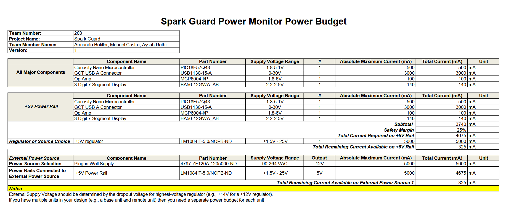

## Overview
The power budget shows the maximum current ratings for each major component and outlines which components are on which power rails, and how much current is needed to supply each rail.

The power monitor power budget only has one +5V power rail from a fixed linear regulator, drawing power from an external +12V wall power supply, linked [here](https://www.digikey.com/en/products/detail/smarts-electronic-technology/ZF120A-1205000/22535301).

## Resources

The power budget as a PDF download is available [*here*](power_budget.pdf), and a Microsoft Excel Sheet [*here*](power_budget.xlsx).