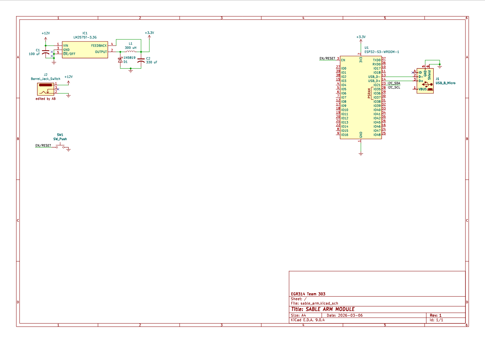

## Overview

This schematic design is for the arm subsystem of SABLE.

{style width:"350" height:"300;"}

## Resouces

The schematic as a PDF download is available [*here*](sable_arm.pdf), and the Zip folder of the project [*here*](sable_arm.zip).