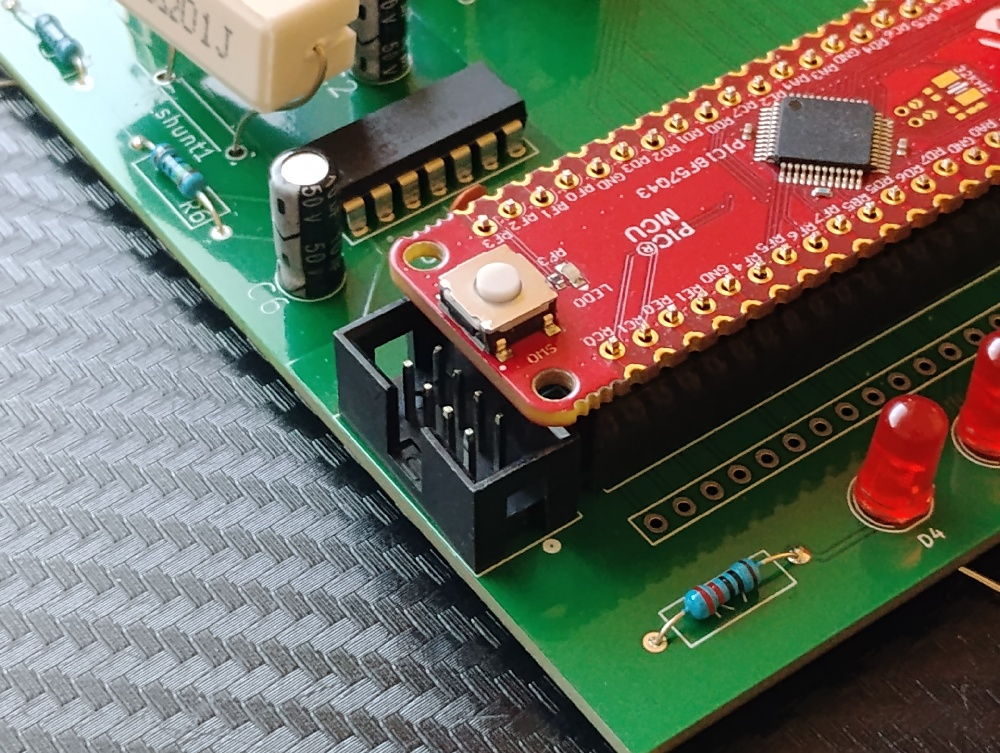

## What would be improved in V2.0
1. No overlapping parts such as the microcontroller covering the 8 pin connector shown below:

    {style width:"200" height:"150";}

2. Make sure hole sizes aren't too large for component, e.g. shown below on the USB: