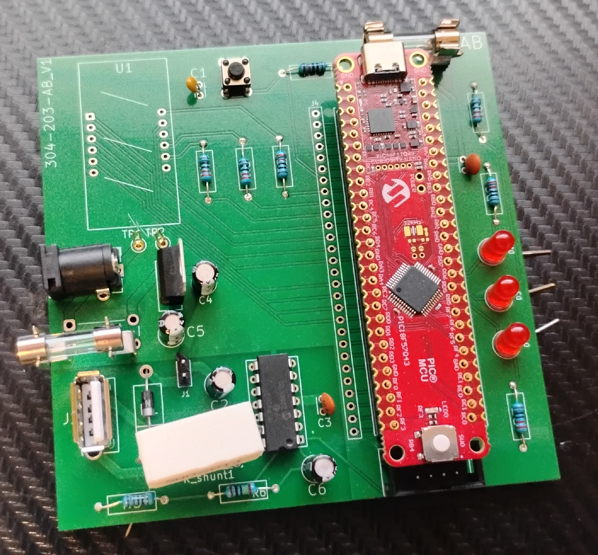
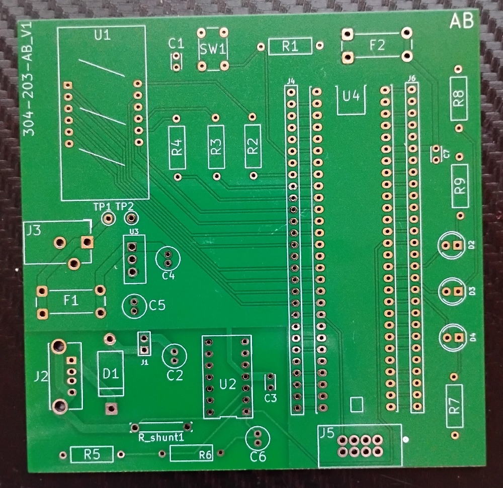
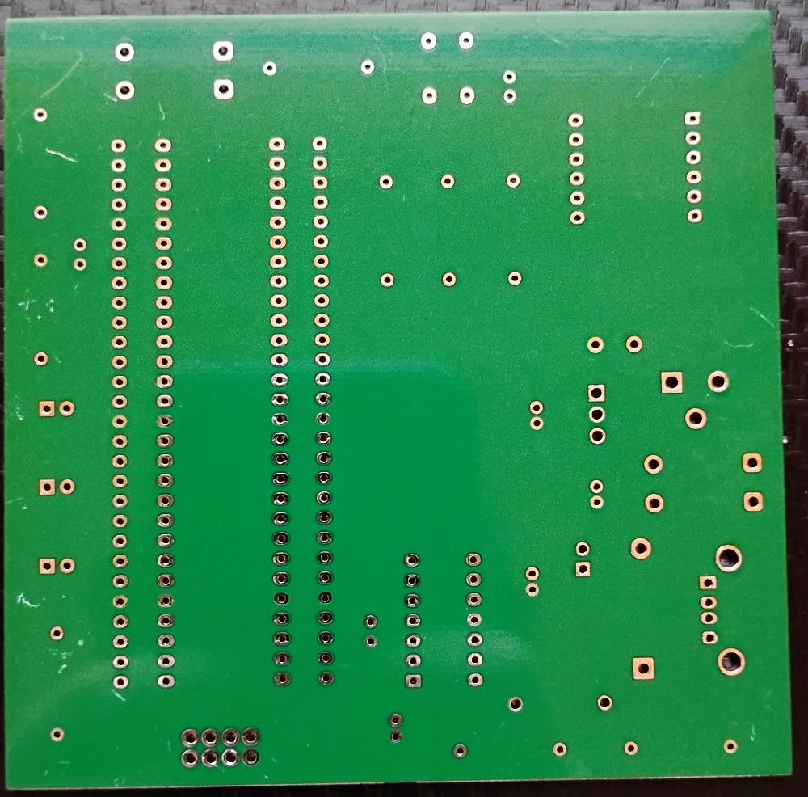
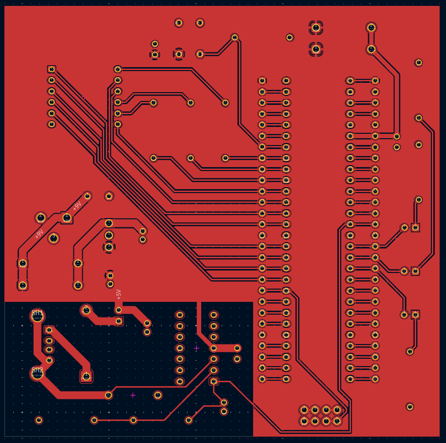
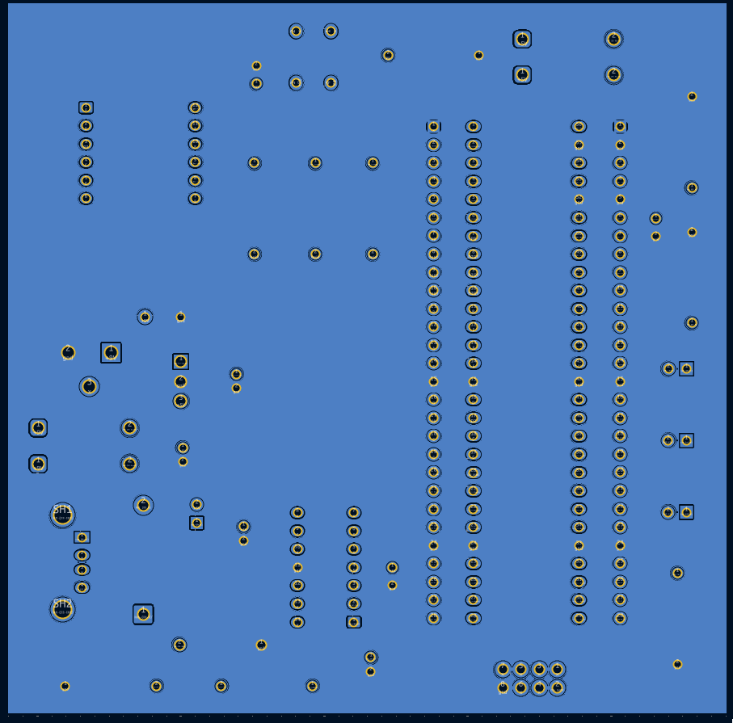
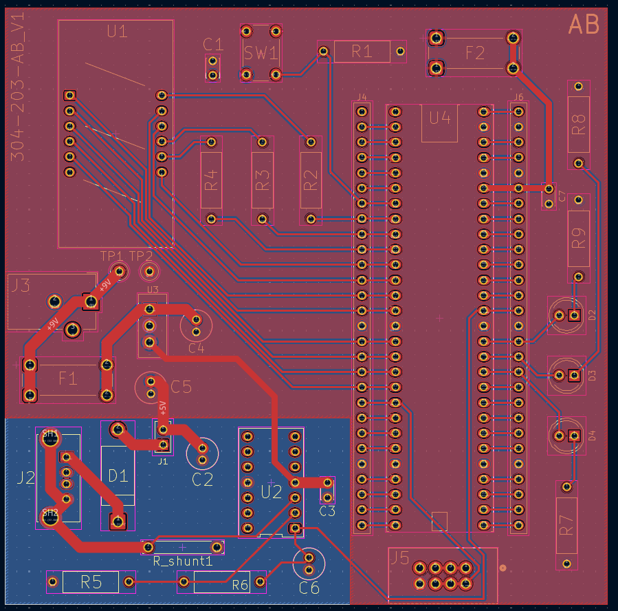

## PCB
 
PCB populated

{style width:"200" height:"200";} 
PCB unpopulated front

 
PCB unpopulated back

## ECAD PCB

 
Top copper layer

Bottom copper layer

{style width:"200" height:"200";}
Both layers overlapped with silkscreens

## Resources

The schematic as a PDF download is available [*here*](power_monitor_PCB.pdf), and the Zip folder of the project [*here*](sparkguard_power_monitor.zip), and gerber files for manufacturing [*here*](gerber.zip).