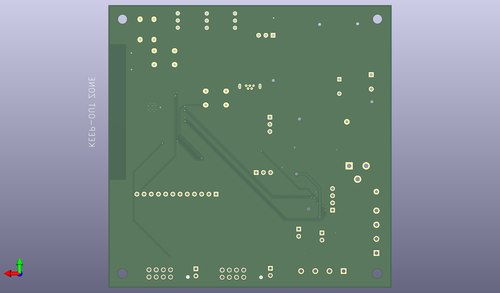
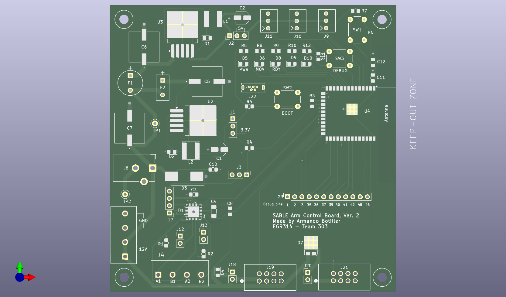
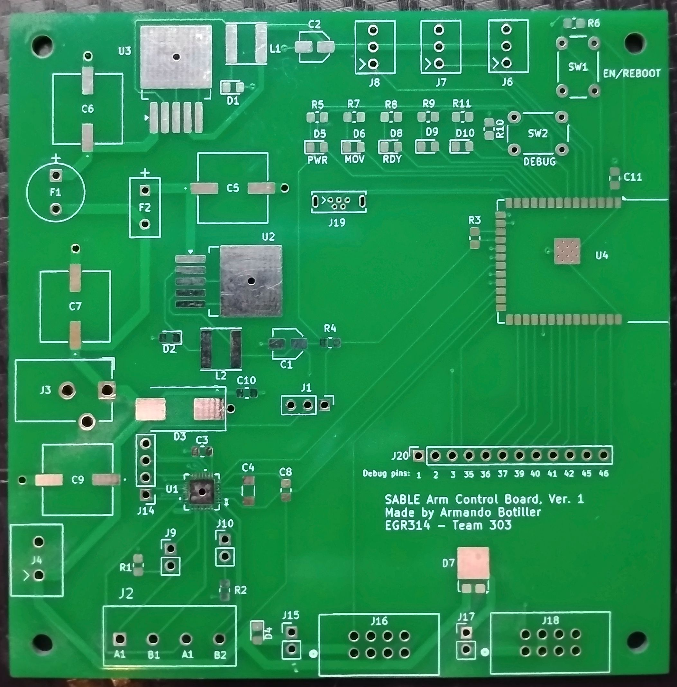
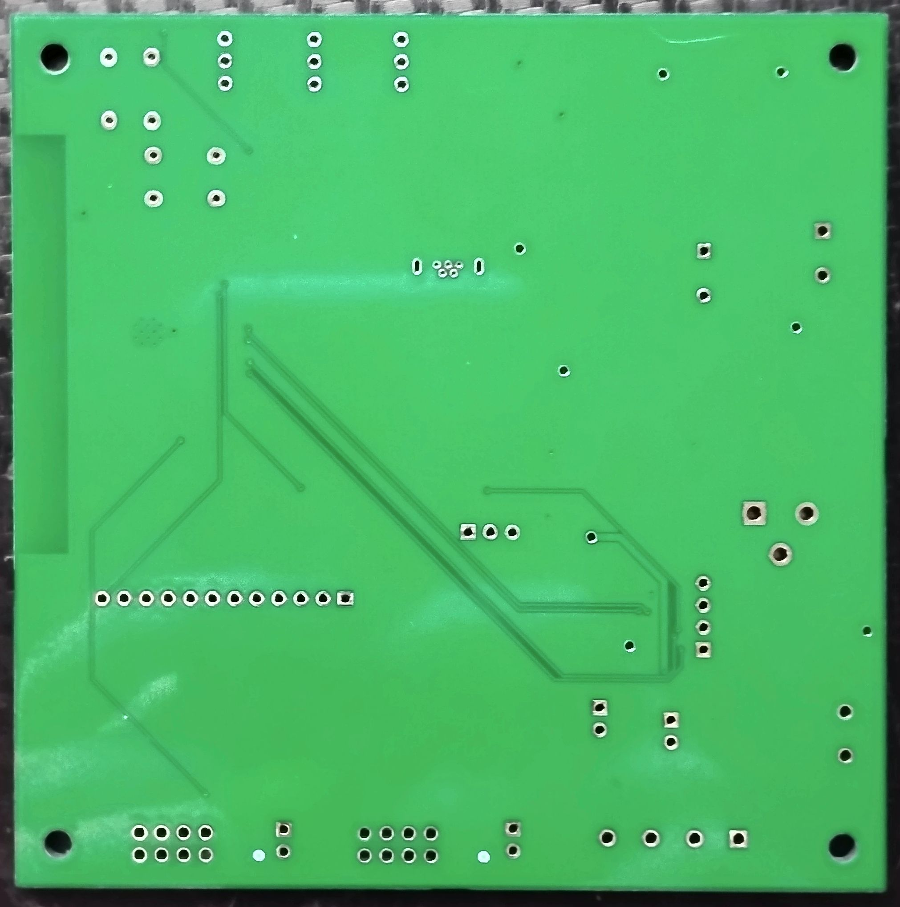
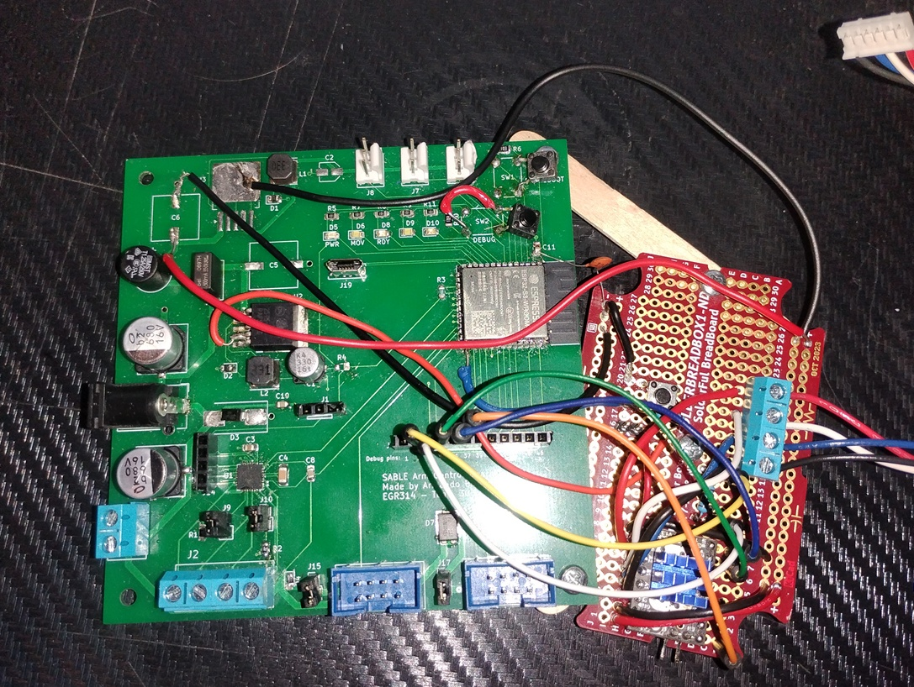
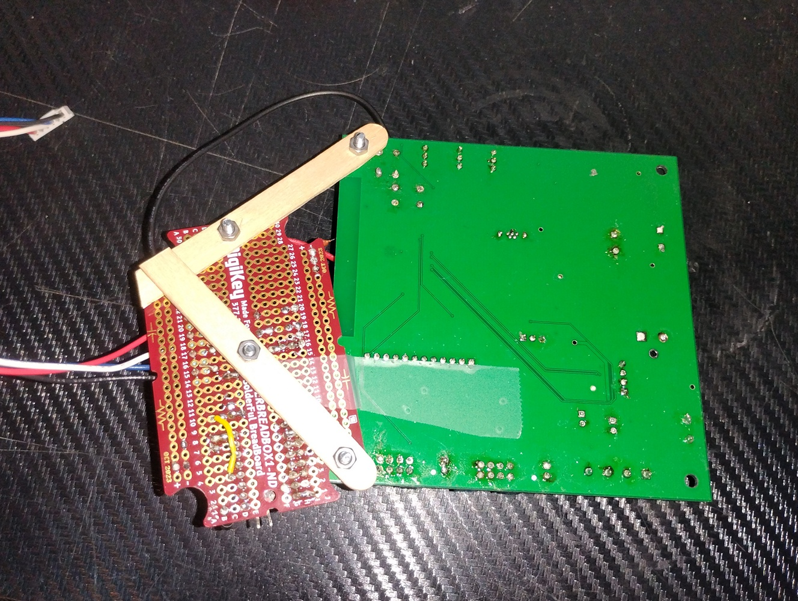

## Overview
This PCB design is for the arm subsystem of SABLE.

## PCB Ver 2. *(current version)*
Below is the current version of the PCB, ver. 2, which improved upon the errors of ver. 1 and added more test points/extra pins for the +5V, +3.3V, and +12V buses.

## PCB Ver 1. unpopulated

## PCB Ver 1. populated and added fixes

## Resources
The PCB as a PDF download is available [*here*](sable_arm_PCB.pdf), and the Zip folder of the gerber and drill files [*here*](sable_arm_gerber_drill.zip).

Below is the latest PCB design which you can view as layers

<object data="https://botilarm.github.io/06-Schematic/sable_arm_PCB.pdf" type="application/pdf" width="100%" height="900px">
      
Unable to display PDF file. <a href="https://botilarm.github.io/06-Schematic/sable_arm_PCB.pdf">Download</a> instead.
