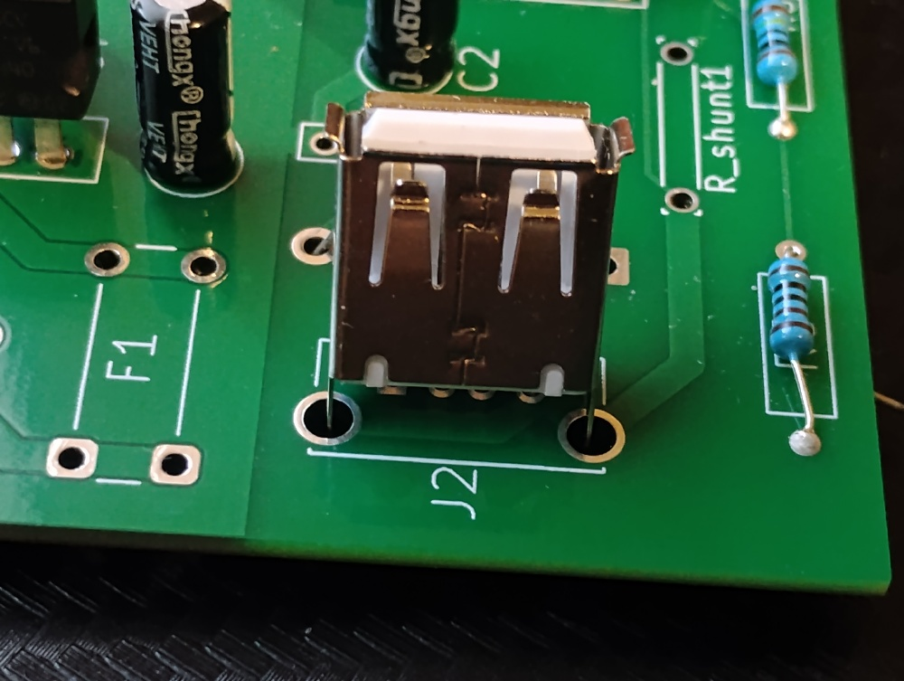

## What would be improved in V2.0
1. No overlapping parts such as the microcontroller covering the 8 pin connector shown below:

    {style width:"200" height:"150";}

2. Make sure hole sizes aren't too large for component, e.g. shown below on the USB:

    {style width:"200" height:"150";}

3. Make the design more miniaturized and compact. A current sensor display in modern times should not be as large as 100x100mm.

4. More testpoint should be added so that subsystem can be verified and debugged with oscilloscope at multiple points. 

5. Future designs should have power for the control parts of the circuit completely isolated from the current sensing resistor and load.